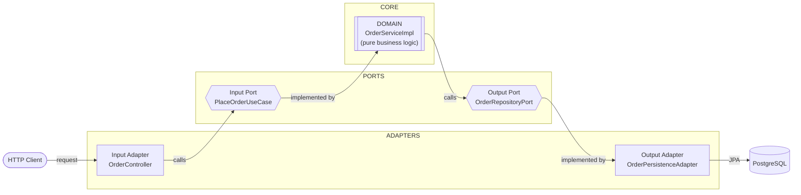
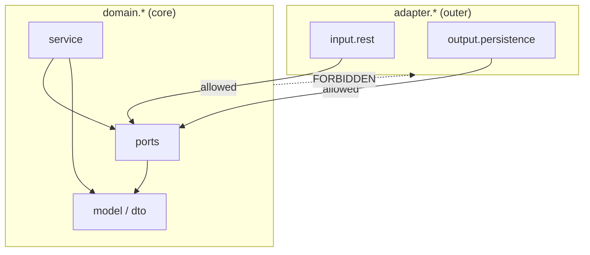
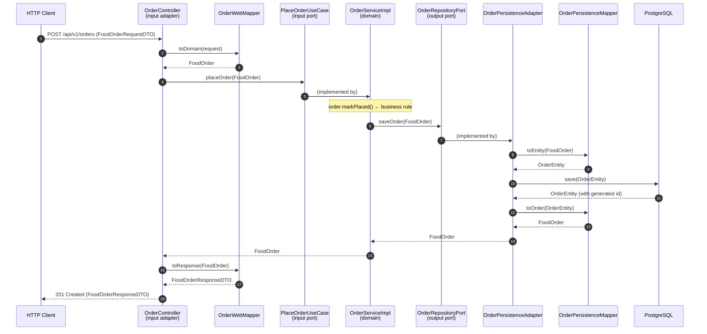

# Hexagonal Architecture — Food Order Service

A small Spring Boot practice project that implements the **Hexagonal Architecture** (a.k.a.
**Ports & Adapters**) pattern around a simple "place a food order" use case.

The goal of this repo is not the feature itself — it's to show *how the code is arranged* so that
business logic stays independent of frameworks, databases, and delivery mechanisms.

---

## 1. What is Hexagonal Architecture?

Hexagonal Architecture divides an application into three concentric regions: **adapters** on the
outside, **ports** as the boundary, and a pure **domain** at the center.



### The one rule that matters: the Dependency Rule

> **Dependencies always point inward.** Adapters depend on the domain. The domain depends on
> nothing outside itself.

Concretely, in this project the **domain must never import**:
- anything from `adapter.*`
- Spring (`org.springframework.*`)
- JPA (`jakarta.persistence.*`)

The domain only knows about **ports** (its own interfaces). Adapters *implement* those ports, so at
runtime Spring injects the adapter behind the interface — but the domain never learns its name.

### Ports vs Adapters

| Term | Meaning | Example in this repo |
|------|---------|----------------------|
| **Input (driving) port** | An interface describing a use case the app offers | `PlaceOrderUseCase`, `TrackOrderUseCase` |
| **Input adapter** | Something that *calls* an input port | `OrderController` (REST) |
| **Output (driven) port** | An interface the domain needs the outside world to fulfill | `OrderRepositoryPort` |
| **Output adapter** | Something that *implements* an output port | `OrderPersistenceAdapter` (JPA) |

---

## 2. Project Structure

```
src/main/java/com/panharoth/hexagonalarchitecture
│
├── domain/                          ← THE CORE. No framework/adapter imports allowed.
│   ├── dto/
│   │   ├── FoodOrder.java              domain model (mutable, holds business behavior)
│   │   ├── FoodOrderRequestDTO.java    what a client is allowed to send  (record)
│   │   └── FoodOrderResponseDTO.java   what a client receives            (record)
│   ├── exception/
│   │   └── OrderNotFoundException.java business exception (framework-free)
│   ├── port/
│   │   ├── input/                      ← INPUT PORTS (use cases)
│   │   │   ├── PlaceOrderUseCase.java
│   │   │   └── TrackOrderUseCase.java
│   │   └── output/                     ← OUTPUT PORTS (what the domain needs)
│   │       └── OrderRepositoryPort.java
│   └── service/
│       └── OrderServiceImpl.java       business logic; implements the input ports
│
├── adapter/                         ← THE OUTSIDE. May import domain, Spring, JPA.
│   ├── input/
│   │   └── rest/
│   │       ├── OrderController.java     drives the app via HTTP
│   │       ├── mapper/OrderWebMapper.java   DTO  ↔ domain
│   │       └── exception/
│   │           ├── GlobalExceptionHandler.java  maps exceptions → HTTP status
│   │           └── ErrorResponse.java           JSON error shape
│   └── output/
│       ├── OrderPersistenceAdapter.java implements OrderRepositoryPort
│       ├── entity/OrderEntity.java      JPA @Entity (persistence model)
│       ├── repository/OrderRepository.java  Spring Data JpaRepository
│       └── mapper/OrderPersistenceMapper.java  domain ↔ entity
│
├── config/                          ← Spring wiring/configuration
└── HexagonalArchitectureApplication.java
```

The dependency rule, drawn as allowed import directions:



Adapters may point into the domain; the domain may **never** point out into an adapter.

---

## 3. The Four Models (and why there are four)

A single "order" is represented by **four different types**, each owned by exactly one layer. This
looks like duplication, but each type answers a different question:

| Type | Layer | Kind | Question it answers |
|------|-------|------|---------------------|
| `FoodOrderRequestDTO` | web input | `record` (immutable) | *What is a client allowed to send?* (no `orderId`, no `status`) |
| `FoodOrder`           | domain    | `class` (mutable)    | *What does the business reason about?* (has behavior: `markPlaced()`) |
| `OrderEntity`         | persistence | JPA `@Entity`      | *How is it stored?* (`@Id` UUID, table `orders`) |
| `FoodOrderResponseDTO`| web output | `record` (immutable) | *What does a client see?* (`orderId` + `status` included) |

Why the domain model is a **mutable class** while the DTOs are **records**: DTOs are immutable data
envelopes that cross a boundary once. The domain model is a *living object* whose state changes as
business rules run — e.g. `markPlaced()` sets the status. A `record` can't express that.

---

## 4. Following a Request End-to-End (POST /api/v1/orders)



Two things to notice:

1. **The domain never sees a DTO or an entity.** `OrderServiceImpl` only touches `FoodOrder`.
2. **Every boundary has its own mapper.** The web edge uses `OrderWebMapper` (DTO ↔ domain); the
   persistence edge uses `OrderPersistenceMapper` (domain ↔ entity). Neither knows about the other.

---

## 5. Key Design Decisions Explained

### Why does `OrderServiceImpl` return `FoodOrder` instead of `FoodOrderResponseDTO`?

Because it implements a **domain-facing port**, so it must speak domain language. If it returned a
REST response DTO:
- the domain would depend on a presentation shape (breaks the dependency rule), and
- any *other* driver (a Kafka consumer, a test, a scheduled job) calling `placeOrder(...)` would be
  forced to receive a *REST* object, which makes no sense.

Presentation (HTTP status, JSON field names) is a web concern, so the **controller** builds the
response DTO — at the edge, after the use case returns.

### Why is the business rule `markPlaced()` on `FoodOrder`, not in the service?

Business behavior belongs on the domain model where the data lives. The service *orchestrates*
(call rule → persist), but the rule itself (`status = "ORDER PLACED"`) is a property of an order.
As the domain grows (`PLACED → COOKING → DELIVERED`), those transitions live on `FoodOrder` too.

### Why two mappers instead of one?

Each mapper serves a different boundary and must not leak the other's types:
- `OrderPersistenceMapper` (in the output adapter): `FoodOrder ↔ OrderEntity`
- `OrderWebMapper` (in the input adapter): `FoodOrderRequestDTO → FoodOrder → FoodOrderResponseDTO`

Putting a web DTO into the persistence mapper (or vice versa) would couple two adapters that should
never know about each other. Both are generated by **MapStruct** at compile time.

### Why is `OrderRepository` (JpaRepository) separate from `OrderPersistenceAdapter`?

They play two distinct roles that Spring-Data-with-hexagonal keeps apart:
- `OrderRepository` — a Spring Data `JpaRepository<OrderEntity, UUID>`; pure infrastructure, Spring
  auto-implements it and talks to Postgres.
- `OrderPersistenceAdapter` — implements the domain's `OrderRepositoryPort`, *uses* the JPA
  repository, and maps `OrderEntity ↔ FoodOrder`. This is the class that satisfies the port.

### Exception handling across the boundary

- `OrderNotFoundException` lives in the **domain** — it carries business meaning and is framework-free.
- `GlobalExceptionHandler` (`@RestControllerAdvice`) lives in the **web adapter** — it translates
  that exception into an HTTP **404** with a consistent `ErrorResponse` body. Status codes are a
  delivery concern, so they belong at the edge, not in the core.

---

## 6. Tech Stack

- **Java 21**, **Spring Boot 4.1.0** (`spring-boot-starter-webmvc`, `spring-boot-starter-data-jpa`)
- **PostgreSQL** (runtime)
- **MapStruct 1.6.3** — compile-time mappers (with `lombok-mapstruct-binding` so it sees Lombok getters/setters)
- **Lombok** — boilerplate reduction
- **Gradle** (wrapper included)

---

## 7. Running the Project

### Prerequisites
- JDK 21
- A running PostgreSQL instance

### Configure the database
`src/main/resources/application.yaml`:
```yaml
spring:
  datasource:
    url: jdbc:postgresql://localhost:5432/order_hexagonal_db
    username: <your-user>
    password: <your-password>
  jpa:
    show-sql: true
    hibernate:
      ddl-auto: update
```

Create the database first:
```sql
CREATE DATABASE order_hexagonal_db;
```

### Build & run
```bash
./gradlew clean build      # compiles + runs MapStruct's annotation processor
./gradlew bootRun          # starts the app on http://localhost:8080
```

> MapStruct regenerates its mapper implementations on **every compile** — there is no separate
> generation step. Use `./gradlew clean compileJava` to force a full regeneration after changing a
> DTO shape.

---

## 8. API

### Place an order
```http
POST /api/v1/orders
Content-Type: application/json

{
  "customerName": "Panharoth",
  "restaurantName": "Sushi Bar",
  "item": "Salmon Roll"
}
```
**201 Created**
```json
{
  "orderId": "3f2504e0-4f89-41d3-9a0c-0305e82c3301",
  "customerName": "Panharoth",
  "restaurantName": "Sushi Bar",
  "item": "Salmon Roll",
  "status": "ORDER PLACED"
}
```
Note the client does not send `orderId` (the DB generates it) or `status` (the service sets it).

### Track an order
```http
GET /api/v1/orders/{orderId}
```
> Currently a stub. When implemented, a missing order will throw `OrderNotFoundException`, which
> `GlobalExceptionHandler` turns into **404 Not Found**.

---

## 9. The Mental Model to Take Away

- **Point all arrows inward.** If a domain file imports from `adapter`, Spring, or JPA — that's a bug.
- **Ports are interfaces owned by the domain.** Adapters implement (output) or call (input) them.
- **Each layer owns its own type**, and mappers translate at the boundaries.
- **Business rules live in the domain**; frameworks live in adapters. You could swap REST for gRPC,
  or Postgres for MongoDB, by writing new adapters — without touching `domain/`.
